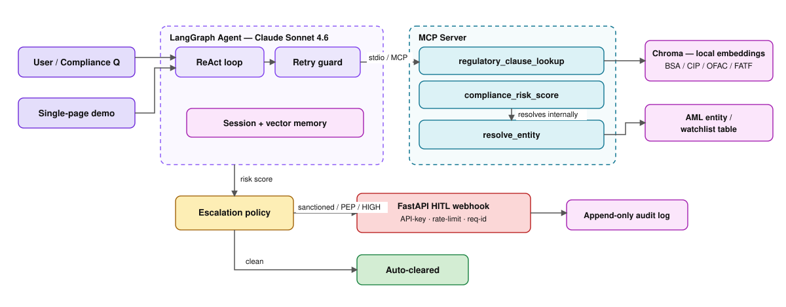

<div align="center">


<br/>

**An MCP server exposing financial-compliance tools to an LLM agent — with defensive retries, memory, an eval-driven accuracy loop, human-in-the-loop escalation, and a single-page demo.**

<br/>


[Architecture](#-architecture) · [Demo](#-demo) · [Quickstart](#-quickstart) · [Results](#-measured-results) · [Security](#-security)

<br/>


<sub>Live agent: resolve customer → score AML risk → cite the controlling BSA clause → escalate high-risk cases with an audit trail.</sub>

</div>

---

## ⟡ What it is

**AEGIS** is a compliance assistant for **AML / KYC** workflows under the US Bank Secrecy Act. A LangGraph agent (Claude Sonnet 4.6) answers regulatory questions by calling three domain tools exposed over the **Model Context Protocol (MCP)**: it resolves a customer entity, scores its risk, and cites the controlling BSA/CIP clause — routing high-risk decisions to a human reviewer with an immutable audit trail.

> **Status: all 8 phases complete + working demo.** MCP server, 3 tools, live agent, memory, an eval loop that took citation accuracy **42% → 96%**, HITL escalation, hardening, and a single-page UI. 48 automated tests; agent + demo live-validated end-to-end.

## ⟡ Architecture



## ⟡ Demo

A single-page UI (cyber-noir, no build step): type a compliance question and watch the agent **resolve → score → cite → escalate** in real time, with the full tool trace and the escalation decision.

```powershell
.venv\Scripts\python.exe -m uvicorn demo.app:app --port 8802
# open http://127.0.0.1:8802   (any free port works; matches the demo gif)
```

| Query | Behavior |
|---|---|
| *"When must a bank file a CTR?"* | clause lookup only — no risk score, no escalation |
| *"Onboarding risk for 'Volkov Petrochem'?"* | risk score → sanctioned → **escalated** (case ID + audit row) |
| *"Is 'Northwind Trading LLC' high-risk?"* | risk score → **auto-cleared** |

## ⟡ The three tools

| Tool | What it does | Implementation |
|------|--------------|----------------|
| `resolve_entity` | Fuzzy-matches a raw name to a canonical AML/KYC entity; surfaces `sanctioned` / `pep` / `watchlist` | `rapidfuzz` over names + aliases; confidence-thresholded and length-guarded to prevent false sanctions hits |
| `compliance_risk_score` | Customer risk rating (0–1 + band) with explainable factors; internally resolves the entity | **Deterministic rules only** — kept transparent and auditable on purpose (an LLM tie-break layer was scoped but intentionally omitted so every escalation has a defensible reason) |
| `regulatory_clause_lookup` | Semantic search over a BSA/CIP/OFAC/FATF corpus → citations + scores | Chroma RAG with a **local** embedding model — zero per-query token cost |

## ⟡ Quickstart

```powershell
# 1. Install
python -m venv .venv
.venv\Scripts\python.exe -m pip install -e ".[dev]"

# 2. Secrets live OUTSIDE the repo (never committed, never diffed)
notepad $HOME\.mcp-compliance.env
#   ANTHROPIC_API_KEY=sk-ant-...        (required)
#   LANGSMITH_API_KEY=lsv2_...          (optional — eval tracing only)

# 3. Test  ·  4. Demo  ·  5. MCP server standalone
.venv\Scripts\python.exe -m pytest -q
.venv\Scripts\python.exe -m uvicorn demo.app:app --port 8802
.venv\Scripts\python.exe -m mcp_server.server
```

```python
import asyncio
from agent.graph import ask

print(asyncio.run(ask(
    "A new legal-entity customer wants to open an account. "
    "What identity and beneficial-ownership info must we collect? Cite the rule."
)))
```

## ⟡ Measured results

Measured with the LangSmith eval loop over a 24-item AML/KYC dataset.

- **95.8% citation-correct accuracy** — improved from a 41.7% baseline across 4 trace-driven iteration cycles (prompt-discipline + retrieval fixes), with strict and normalized scorers agreeing at 95.8%.
- **100% tool-selection accuracy** — the agent picks and sequences the right tools every time.
- **~1.65× lower cost** — mean cost/query reduced **$0.0218 → $0.0132** via redundant-round-trip elimination and cache-aware token accounting.
- **~83–100% reduction in false-positive flags** — the HITL escalation policy vs. a flat-threshold baseline, across modeled reviewer accuracy (`evals/analyze_hitl.py`).

| Eval cycle | Accuracy | Change |
|---|---:|---|
| Baseline | 41.7% | initial agent + scorer |
| Scorer normalized | 83.3% | citation matching corrected |
| Root-cause fixes | **95.8%** | prompt citation discipline + retrieval fix |
| Cost-optimized | **95.8%** | accuracy held while cutting cost ~39% |

## ⟡ Security

| Concern | Mitigation |
|---|---|
| Secrets in repo / git / tool diffs | Resolved from OS env or a secrets file **outside the project tree** (`~/.mcp-compliance.env`); project `.env` is non-secret only |
| Unauthenticated webhook | `X-API-Key` auth on all data/mutation routes (`/health` open); fail-open only when no key is configured (documented dev mode) |
| Abuse / floods | In-memory sliding-window rate limiter → `429` + `Retry-After` |
| Traceability | `X-Request-ID` assigned/propagated + one structured JSON access log per request |
| Tamperable decision history | Append-only audit trail — no update/delete path; every escalation and review is recorded |

## ⟡ Project layout

```
mcp_server/   MCP server, 3 tools, Chroma index, seed corpora
agent/        LangGraph agent, retry guard, session + vector memory
hitl/         escalation policy, FastAPI webhook, audit trail, security
evals/        LangSmith dataset + runner + failure / HITL analysis
demo/         FastAPI single-page UI (resolve → score → cite → escalate)
config/       env-backed settings (secrets resolved out-of-repo)
tests/        48 tests — tools, retrieval, agent, memory, HITL, security
```

## ⟡ Roadmap

- [x] **Phase 1** — MCP skeleton, deps, server boots
- [x] **Phase 2** — 3 tools real + tested (entity / risk / clause)
- [x] **Phase 3** — LangGraph agent over MCP stdio, live-validated
- [x] **Phase 4** — session memory, Chroma long-term memory, retry guard
- [x] **Phase 5** — LangSmith eval harness + baseline (cost-aware scorer)
- [x] **Phase 6** — trace-driven iteration: 41.7% → 95.8%, cost −39%
- [x] **Phase 7** — FastAPI HITL escalation + append-only audit trail
- [x] **Phase 8** — hardening: API-key auth, rate limiting, request-id logging
- [x] **Demo** — single-page UI, live-validated

<div align="center">
<br/>
<sub>Built by <a href="https://github.com/nehashirodkar">Neha Shirodkar</a> with the Claude Agent SDK</sub>
</div>
